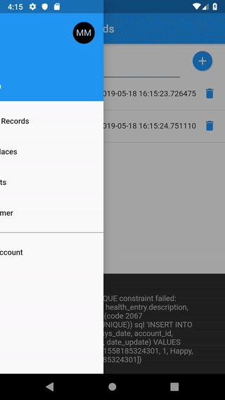
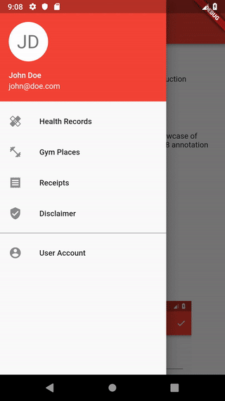

# Full example for `flutter-sqlite-m8-generator` 

This is a sample showcase for the facets of `flutter-sqlite-m8-generator`

## Disclaimer

This is a demo application. Do not use for production purposes.

## Purpose

The only purpose of this example is to be a showcase of `flutter-sqlite-m8 generator` based on the `flutter-orm-m8` annotation framework.

## Dependencies

* flutter-sqlite-m8
* flutter-orm-m8

## CRUD showcase

For this purpose we are demonstrating how to use the code generator and how to integrate the generated code into a demo `Gymspector` application

### Interface: DbAccountEntity

* Example: User Account
* Model: UserAccount
* Field types: 
  * bool
  * int
  * String

### Interface: DbAccountRelatedEntity

* Example: Health Records
* Model: HealthEntry\n
* Field types: 
  * DateTime
  * int
  * String   

### Interface: DbEntity

* Example: Gym Places
* Model: GymLocation
* Field types: 
  * int
  * String

### Interface: DbEntity

* Example: Receipts
* Model: Receipt
* Field types: 
  * bool
  * DateTime
  * double
  * int
  * num
  * String

